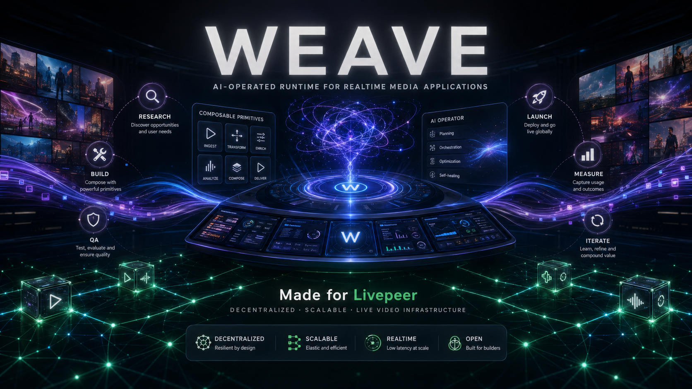

# WEAVE



WEAVE is a runtime and agent-company package for building applications from
agent-run product lifecycle work.

## Quickstart

Clone the repo and follow [docs/quickstart.md](docs/quickstart.md) to validate
the package, run the test suite, execute a lifecycle dry-run, and configure the
approval-gated Telegram gateway. The base validation path needs no API keys and
no network calls. See [docs/runtime-home.md](docs/runtime-home.md) for the
durable runtime-home contract.

Before onboarding, pick one deployment mode:

- **Managed container:** WEAVE builds a pinned Hermes gateway container after
  Hermes normal-chat setup is confirmed.
- **Existing Hermes attach:** Hermes already works; WEAVE does not install
  Hermes or mutate provider auth. It creates the deterministic WEAVE runtime
  home, source map, app state, and `weave-runtime` Hermes plugin/config.
- **Slash-only deterministic mode:** normal Hermes chat stays blocked, but the
  deterministic Telegram command surface is configured.
- **Host-local fallback:** WEAVE can install a pinned Hermes checkout into
  ignored local runtime state when containerization is not desired.

Useful first commands:

```bash
bin/weave help
bin/weave doctor
bin/weave eval --list
bin/weave first-run --app-id demo-app --app-name "Demo App"
bin/weave onboard --dry-run
bin/weave command /status
python3 scripts/full_conversation_app_dogfood.py --help
python3 scripts/private_app_operating_profile_eval.py --list
```

## Version

Current public package version: `2026.05.13-console`.
Intended release tag: `v2026.05.13-console`.

## Missions

A WEAVE mission is a scoped unit of work dispatched to an agent, tracked
through the lifecycle plus the post-KPI growth loop, and settled with a credit
grant on verified completion. See
[docs/missions/MISSION_TEMPLATE.md](docs/missions/MISSION_TEMPLATE.md) for the
mission format, required fields, and a worked example.

The current release shape is deliberately narrow:

- WEAVE is a standalone repository.
- Hermes is the active runtime and CEO agent dependency.
- WEAVE supplies the company package, lifecycle, primitives, adapter boundaries,
  agent skill contracts, and validation tests.

## Repository Layout

```text
docs/                  Public documentation and replication architecture.
packages/weave-tool/   Hermes-default WEAVE company package.
scripts/               Local validation, smoke, runtime, and gateway scripts.
tests/                 Public-safe validation tests.
```

## Validate

Validate the WEAVE company package:

```bash
python3 packages/weave-tool/scripts/validate_company_package.py packages/weave-tool
```

Run the public-safe test suite:

```bash
python3 -m unittest discover -s tests -p 'test_*.py'
```

Run the lifecycle and deterministic Telegram command smoke:

```bash
python3 scripts/runtime_smoke.py
```

Inspect lifecycle eval contracts and generate an evidence-bound review template:

```bash
bin/weave eval --list
bin/weave eval engineering --review-template
```

Run release-readiness gates before push or release:

```bash
bin/weave eval release-readiness --run-gates --review-file release-review.json
```

See [docs/lifecycle-evals.md](docs/lifecycle-evals.md) for the stage contract
model: deterministic hard gates, rubric scoring, evidence requirements, and
explicit advance/block decisions.

## Try the conversation-to-app workflow locally

The fastest way to try the full app-production loop without Telegram, provider
keys, hosting, analytics, payments, or public side effects is the dedicated
scripted dogfood runner:

```bash
mkdir -p runs/full-conversation-app-dogfood
python3 scripts/full_conversation_app_dogfood.py \
  --report-out runs/full-conversation-app-dogfood/report.json \
  --output-dir runs/full-conversation-app-dogfood/artifacts \
  --transcript-out runs/full-conversation-app-dogfood/transcript.md
```

What it does:

- creates an isolated local WEAVE root;
- creates the `Pocket Orchard` app workspace;
- walks Intent, Research, Selection, Plan, Engineering, QA, KPI Setup,
  Marketing, Iteration, and Analysis;
- generates a dependency-free static app under
  `runs/full-conversation-app-dogfood/artifacts/generated-app/`;
- exports conversation review artifacts and a JSON run report;
- records explicit non-claims so local scripted proof is not mistaken for live
  Hermes/Telegram proof.

Inspect the generated app by opening
`runs/full-conversation-app-dogfood/artifacts/generated-app/index.html` in a
browser, or serve that generated-app directory with any local static-file server.
For the committed review artifact and proof boundary, see
[docs/month1/full-conversation-app-dogfood.md](docs/month1/full-conversation-app-dogfood.md).

## Run private app operating-profile evaluations

To test WEAVE's operating-profile model across several private, non-public app
scenarios in parallel, run:

```bash
mkdir -p runs/private-app-operating-profile-evals
python3 scripts/private_app_operating_profile_eval.py \
  --output-dir runs/private-app-operating-profile-evals/artifacts \
  --report-out runs/private-app-operating-profile-evals/report.md \
  --parallel 4 \
  --force
```

`--force` is guarded. It only removes an empty output directory, a root already
marked by this harness with `.weave-private-app-eval-output-root`, or an
explicitly named temporary eval root. Use a fresh `runs/...` directory when in
doubt; do not point it at hand-authored docs or workspaces.

The harness generates ten local-only static apps, one assessment report per app,
and an aggregate report. Its target proof surface is `local deterministic
private-app fixture with generated static apps and reviewable framework-gate
evidence`. Each app includes concrete cognitive artifacts:
intent frame, profile selection, CWA work-domain model, DMN decision table, IBIS
issue map, ADR, action intent/result, and PROV ledger. It intentionally excludes
marketing, hosting, analytics, payments, external sends, live Hermes, and
Telegram/deployed-gateway proof.

The committed generated private-app bundle under
`docs/month1/artifacts/private-app-operating-profile-evals/` is sample review
evidence, not a canonical byte-for-byte fixture. Regenerated artifacts may differ
by timestamps and run hashes/checksums; reviewers should compare schemas, gates,
non-claims, and proof-boundary fields rather than raw bytes. See
[docs/month1/private-app-operating-profile-evals.md](docs/month1/private-app-operating-profile-evals.md).

Run guided onboarding:

```bash
bin/weave onboard
```

Inspect first if you are unsure what is missing:

```bash
bin/weave help
bin/weave doctor
bin/weave onboard --dry-run
```

The guided command first checks whether normal Hermes setup has already been
confirmed. After that gate passes, it builds a pinned Hermes container, creates
the ignored `runs/runtime-home` layout, prepares the Hermes gateway context,
explains the dedicated Telegram bot requirement, hides token input, and
configures the deterministic command plugin without printing secrets. It does
not start the gateway, install autostart, or perform external sends.

If Hermes already exists and can chat, attach WEAVE to that runtime instead of
installing or provisioning Hermes:

```bash
bin/weave onboard --existing-hermes --hermes-ready
# equivalent convenience alias:
bin/weave attach-hermes --hermes-ready
```

Existing-Hermes attach still creates the deterministic WEAVE layer:
`runtime-profile.json`, `weave-state/`, source map, app state, foundation
onboarding files, and the `weave-runtime` Hermes plugin/config. It does not
install Hermes, mutate provider credentials, install a service, start a gateway,
or configure autostart.

Normal Hermes chat is owned by Hermes. Configure providers and verify chat
through the normal Hermes setup flow first, then tell WEAVE that Hermes is
ready:

```bash
HERMES_HOME=runs/runtime-home/hermes-home hermes setup --portal
HERMES_HOME=runs/runtime-home/hermes-home hermes model
bin/weave onboard --hermes-ready
```

To complete setup for deterministic slash commands only, use:

```bash
bin/weave onboard --slash-only
```

After onboarding, run the containerized gateway:

```bash
bin/weave start
bin/weave dashboard
bin/weave status
bin/weave stop
```

Use the read-only TUI operator console before or after the gateway starts to see
the intended WEAVE flow in one place: onboarding, runtime readiness, Hermes
setup, gateway attachment, app portfolio, lifecycle stage, transcript capture,
proof/eval state, inconsistencies, and the next deterministic action. It does
not send messages or start services.

Move reviewable local state without exporting credentials:

```bash
bin/weave export-runtime --out runtime-export.tar.gz
bin/weave import-runtime runtime-export.tar.gz --runtime-home runs/runtime-home
bin/weave verify-runtime --runtime-home runs/runtime-home
```

For a host-local fallback instead of the default container, install the real
pinned upstream Hermes Agent into ignored local state:

```bash
bin/weave onboard --local --install-hermes
```

For CI and operator automation, the backend script remains available:

```bash
python3 scripts/setup_runtime.py \
  --gateway-token-file <owner-approved-token-file> \
  --gateway-allowed-users <numeric-telegram-user-id>
```

Gateway setup defaults to `--autonomy-mode yolo`. In this mode Hermes proceeds
without routine confirmation for non-gated local work, while hard-gated actions
still require Hermes to ask for owner authorization through the Telegram LLM
conversation before acting.

Validate the public-safe workstation context sync sample:

```bash
python3 scripts/context_sync_contract_smoke.py
```

Expected package shape:

```text
valid WEAVE company package: weave
version: 2026.05.13-console
agents: 7
tasks: 9
skills: 13
primitives: 9
prompt_packs: 1
eval_contracts: 11
```

## Runtime Model

WEAVE is packaged as an importable AI-operated company:

```text
WEAVE repo
  -> packages/weave-tool
  -> Hermes CEO/runtime agent
  -> WEAVE lifecycle tasks, skills, and primitives
  -> deterministic Telegram slash commands for state
```

The durable state lives in a runtime home:

```text
runs/runtime-home/
  runtime-profile.json
  weave-state/
  hermes-home/
```

The container and gateway process are replaceable. App work, lifecycle
artifacts, ledgers, profiles, source maps, and reviewable Hermes configuration
live in the runtime home. Raw gateway secrets are not exported by default.

The first-slice REST skeleton can be served locally with:

```bash
python3 scripts/weave_runtime_api.py
```

It binds to loopback, requires the ignored generated local token, and delegates
to the same root, app, ledger, foundation, and stage-derivation primitives used
by the tests.

The operational HTTP wrapper (`scripts/weave_runtime_http.py`) also binds to the
loopback interface by default. It requires bearer auth using the generated
ignored token at `<weave-root>/runtime/tokens/local-api-token` unless started
with the explicit test/dev flag `--allow-unauthenticated-local`. Its `/health`
response reports `transport.auth_policy` so the running service tells the truth
about exposure.

This proves a local instantiation path for the lifecycle runtime. It does not
claim that a VM service, hosted runtime, paid model route, or production
deployment is installed.

Telegram is the operator surface for this release. Normal Telegram messages go
to Hermes only after normal Hermes setup has been confirmed. WEAVE slash
commands are intercepted by the gateway and answered from deterministic local
runtime state with `deterministic: true` and `llm_used: false`.

Available commands are split by side effect:

| Command | Side effect | Purpose |
|---|---|---|
| `/start` | Read-only | Show the deterministic WEAVE command surface. |
| `/help` | Read-only | List deterministic WEAVE commands. |
| `/autonomy` | Read-only | Show autonomy mode and hard approval gates. |
| `/status [app_id]` | Read-only | Show the WEAVE wall or one app wall. |
| `/sources` | Read-only | Show runtime source map, history surfaces, and active/stale/missing state. |
| `/apps [--all]` | Read-only | List apps, lifecycle stage per app, and attention state. |
| `/app <app_id>` | Read-only | Show one app wall. |
| `/lifecycle [app_id]` | Read-only | Show lifecycle gate state. |
| `/stage [app_id]` | Read-only | Show current lifecycle stage state. |
| `/requirements [app_id]` | Read-only | Show current-stage requirements and missing inputs. |
| `/blockers` | Read-only | Show apps that need owner or Hermes action. |
| `/changes [app_id]` | Read-only | Show latest recorded changes for one app or all apps. |
| `/transcript [app_id]` | Read-only | Show recent captured conversation turns. |
| `/next` | Read-only | Show the next deterministic owner-visible action. |
| `/create_app <name>` | Local state-changing | Create and select a product app workspace. |
| `/switch_app <app_id>` | Local state-changing | Select the active Telegram app. |
| `/approve_stage [app_id] [stage]` | Local state-changing | Record owner approval after gates pass. |
| `/advance [app_id]` | Local state-changing | Advance after the current stage is owner-approved. |

See [docs/telegram-slash-commands.md](docs/telegram-slash-commands.md) for the
full command contract and response shape.

Hermes carries a public prompt/spec package at
`packages/weave-tool/prompts/hermes-gestalt-runtime-pack/`. That pack is the
reviewable contract for moving a user from raw app idea to Gestalt Kernel,
Gestaltian Contract, Premortem, Build-Ready Handoff Packet, bounded
implementation, validation, and Contract Update.

Use `bin/weave onboard` for the human setup flow. In managed-container mode
after Hermes readiness is confirmed, it builds a local Docker image from
`container/hermes/Dockerfile` at pinned upstream Hermes commit
`5921d667855880b0aa2083a50f001748aed52f3e`, then records the image in
`runs/runtime-home/runtime-profile.json`. Existing-Hermes attach, slash-only
deterministic mode, and host-local fallback do not require that image. Use
`scripts/setup_runtime.py` for automation, CI, and non-interactive runtime
profiles. Add `--local --install-hermes` to clone the real upstream Nous Hermes
Agent into an isolated venv under
`runs/hermes-agent/`, install the CLI package there, and attach that proof to
the runtime profile. These install paths use outbound network access, but they
do not install services, read secrets outside the explicit Telegram token flow,
contact private gateways, pair Telegram without owner input, or claim that a
hosted runtime exists.

For Telegram, guided onboarding asks for a dedicated bot token and numeric
Telegram user id. Token input is hidden and copied only into local Hermes
environment state. Provider credentials and route verification stay inside
Hermes; WEAVE records only non-secret setup readiness state with
`bin/weave hermes status`. It does not start the gateway, install autostart, or
place secrets in tracked files and public artifacts. The narrower
`scripts/setup_gateway.py` helper is available when Hermes is already
installed and only gateway environment configuration is needed.

The public workstation context sync contract in
`docs/workstation-context-sync.md` shows how completed local work can be
recorded into a runtime ledger as evidence and decisions. The included sample
uses public-safe paths only and performs no network writes.

The main lifecycle is:

1. Intent.
2. Research.
3. Selection.
4. Plan.
5. Engineering.
6. QA.
7. KPI Setup.
8. Marketing.

After KPI Setup, the growth loop can run under Marketing:

- Iteration: build, deploy, and record feedback-driven changes.
- Analysis: read usage and feedback, then recommend the next iteration.

Research starts only after Intent is explicit. Engineering starts only after
Selection and Plan are recorded. Marketing and the local growth loop both start
from KPI Setup; external distribution remains approval-gated.

## Boundaries

This repository intentionally does not include:

- private WEAVE operating substrate
- private payment, custody, funding, or accounting material
- VM, SSH, VPN, private-network, or host-specific proof details
- API keys, gateway tokens, OAuth tokens, private keys, or seed material
- generated private proof logs
- claims that Livepeer-native output is proven before output evidence exists

## Replication

Start with [WEAVE Replication Architecture](docs/replication-architecture.md).

## License

MIT. See [LICENSE](LICENSE).
