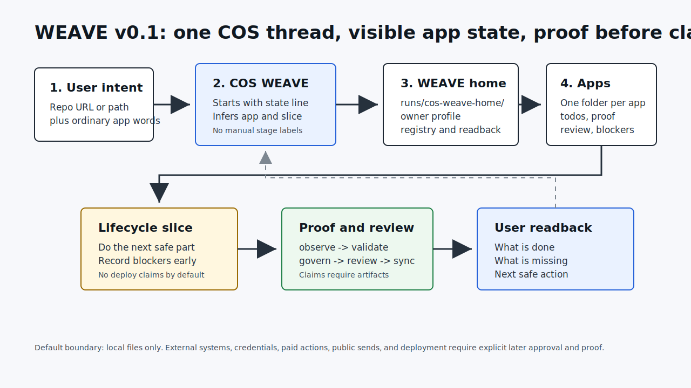
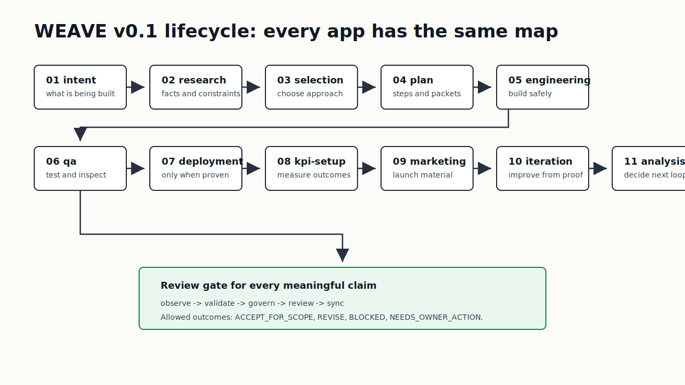

# WEAVE v0.1 User Flow

Status: user-facing process map for `v0.1.0`.

## Simple Flow



1. The user opens a Codex thread.
2. The user gives the thread
   `Use WEAVE release v0.1.0 from https://github.com/its-DeFine/weave.git`
   plus ordinary app intent.
3. The thread becomes COS WEAVE and starts every meaningful update with the
   WEAVE state line.
4. COS WEAVE creates or loads `runs/cos-weave-home/`.
5. COS WEAVE captures owner profile, app intent, lifecycle state, todos,
   worker packets, proof, blockers, review state, and readback state.
6. COS WEAVE advances only the next safe lifecycle slice.
7. COS WEAVE records proof, runs review, and reports the actual state.

## Lifecycle Map



Each app folder has the same stage vocabulary:

```text
intent -> research -> selection -> plan -> engineering -> qa -> deployment
-> kpi-setup -> marketing -> iteration -> analysis
```

The stage can be `pending`, `active`, `accepted_for_scope`, `revise`,
`blocked`, or `needs_owner_action`. COS WEAVE must not upgrade a stage based on
confidence alone. It needs an artifact or proof entry.

## Multi-App Shape

```text
runs/cos-weave-home/
  owner-profile.md
  apps/
    registry.json
    calculator/
      intent.md
      lifecycle.json
      todos.md
      worker-packets/
      proof/
      blockers/
      review/
      updates/readback.json
    invoice-tracker/
      intent.md
      lifecycle.json
      todos.md
      worker-packets/
      proof/
      blockers/
      review/
      updates/readback.json
```

The same COS WEAVE thread can manage multiple apps because each app has its own
folder and lifecycle state. Switching apps means reading `apps/registry.json`
and the chosen app folder, not asking the user to remember what happened.
