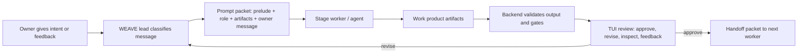

# WEAVE V1 Agent Orchestration And Prompt Library Spec

Status: review draft before implementation.
Date: 2026-06-15
Scope: how lifecycle stage prompts, user replies, prior artifacts, agent runs,
revision loops, and handoffs work behind the Textual TUI.

This document fills the gap left by the backend architecture spec: the backend
defines the machinery, but this spec defines how WEAVE speaks to agents at each
stage so work is coherent, reviewable, repeatable, and gateable.

## 1. Simple Model

Think of WEAVE as a calm operating room with a project lead and specialized
workers.

- The owner says what they want and reviews work.
- WEAVE is the project lead. It chooses which worker should act next, prepares
  the handoff packet, checks the result, and asks the owner for approval.
- The agent is the worker. It receives a clear prelude, the relevant prior
  artifacts, the latest owner message, allowed actions, and required outputs.
- The Textual TUI is the visible room where the owner sees the handoff, the
  worker's result, the evidence, and the next choice.

The owner should not need to understand prompt mechanics. They should feel like
they are speaking naturally to a capable team, while WEAVE keeps the formal
workflow strict in the background.

## 2. Core Principle

Every agent run is created from the same formula:

```text
Global WEAVE prelude
+ Owner profile
+ App world model
+ Stage definition
+ Substage/action prompt
+ Relevant prior artifacts
+ Latest owner message or choice
+ Allowed actions and stop boundaries
+ Required output artifact contract
+ Validation and gate criteria
= Prompt packet for this run
```

The prompt packet is saved before the agent runs. The agent output is saved
after the run. WEAVE then validates outputs, writes ledger events, updates the
world model when needed, and shows the owner the next review choice.

## 3. Terminology

### Stage

A major lifecycle lane:

```text
first_run, owner_profile, app, intent, research, selection, plan, engineering,
qa, deployment, kpi, marketing, iteration, analysis, completion
```

### Substage

A repeated action pattern inside a stage.

Common substages:

```text
start
collect_input
clarify_missing
draft_plan
revise_plan
run_work
synthesize_result
review_result
apply_feedback
validate_gate
handoff_next
```

Not every stage uses every substage.

### Stage Definition

The stable configuration for one lifecycle stage. It defines:

- visible owner question;
- default agent prelude;
- substages;
- required inputs;
- context selectors;
- allowed actions;
- expected artifacts;
- gate criteria;
- failure routes.

### Prompt Template

Reusable text for a specific stage and substage.

Example:

```text
prompt://weave/stages/research/draft_plan/v1
```

### Prompt Packet

The concrete artifact produced for one agent run after WEAVE combines the
prompt template with owner input, context, prior artifacts, and boundaries.

### Work Product

The artifact or file set produced by an agent run.

Examples:

- `intent.md`
- `research-plan.md`
- `selection-options.md`
- `engineering-plan.md`
- generated app source files
- `qa-result.json`

### Review Cycle

The loop:

```text
agent produces work -> WEAVE validates -> owner reviews -> owner approves or
gives feedback -> WEAVE creates a new prompt packet for revision
```

## 4. Agent Run Lifecycle

Every agent run follows this lifecycle:

```text
needed
packet_prepared
queued
running
output_captured
artifacts_extracted
validated
needs_owner_review
approved
revision_requested
failed
blocked
```

### 4.1 Needed

The lifecycle engine decides that an agent action is needed because:

- a stage begins;
- owner provided input;
- owner requested a revision;
- an artifact needs synthesis;
- QA found a failure;
- a stage gate needs validation;
- an approved iteration item routes back to engineering.

### 4.2 Packet Prepared

WEAVE creates a prompt packet from the stage definition and saves it as an
artifact. The packet includes the exact reason for the run.

### 4.3 Running

The executor runs the packet. In v1, Codex is the first real executor. Some
non-engineering stages may initially use the same Codex adapter with different
stage prompts.

### 4.4 Output Captured

WEAVE captures:

- agent transcript summary;
- files created or changed;
- artifacts created;
- command/result metadata;
- claims and non-claims.

### 4.5 Validated

WEAVE checks the output against the required artifact contract and gate
criteria. Validation failure becomes a review item or a retry route, not a
false success.

### 4.6 Needs Owner Review

The TUI shows:

- summary of what was produced;
- artifacts/files;
- evidence;
- non-claims;
- choices: approve, revise, inspect, attach feedback, rerun where relevant.

### 4.7 Approved Or Revision Requested

Approval writes a ledger event and may advance the stage. Revision creates a
new prompt packet that includes the prior work and the owner's feedback.

## 5. Prompt Packet Schema

Prompt packets should be machine-readable and human-reviewable.

Minimum shape:

```json
{
  "schema": "weave/prompt-packet/v1",
  "packet_id": "prompt-intent-clarify-001",
  "app_id": "launch-studio",
  "stage": "intent",
  "substage": "clarify_missing",
  "created_at": "2026-06-15T12:00:00Z",
  "executor": "codex",
  "reason": "owner submitted initial intent; sufficiency review found missing region",
  "global_prelude_ref": "prompt://weave/global/prelude/v1",
  "stage_prompt_ref": "prompt://weave/stages/intent/clarify_missing/v1",
  "owner_profile_ref": "apps/launch-studio/lifecycle/owner-profile/artifacts/owner-profile.md",
  "world_model_ref": "apps/launch-studio/worldmodel.md",
  "input_refs": [
    "apps/launch-studio/lifecycle/intent/artifacts/intent-draft.md"
  ],
  "latest_owner_message_ref": "event:evt_owner_intent_001",
  "selected_context_refs": [
    "apps/launch-studio/lifecycle/app/artifacts/app-manifest.json"
  ],
  "allowed_actions": ["write_artifacts", "ask_clarifying_questions"],
  "forbidden_actions": ["deploy", "public_send", "paid_spend", "read_raw_secrets"],
  "required_outputs": [
    {
      "artifact_type": "intent-review",
      "path": "lifecycle/intent/artifacts/intent-review.json",
      "required": true
    }
  ],
  "gate_criteria": ["intent_sufficiency_evaluated", "missing_information_listed"],
  "public_safe": true
}
```

The full prompt text given to the agent can be generated from this packet and
stored as a separate public-safe artifact:

```text
lifecycle/<stage>/artifacts/prompt-packets/<packet-id>.md
```

## 6. Prompt Assembly Method

WEAVE assembles a prompt in fixed sections so every worker receives context in
the same order.

### 6.1 Section Order

```text
1. WEAVE global operating prelude
2. Current worker role
3. Current lifecycle stage and substage
4. Owner profile and collaboration style
5. App world model
6. Prior artifacts to read
7. Latest owner input or review feedback
8. Task instructions
9. Required outputs
10. Validation criteria
11. Stop boundaries
12. Response format
```

### 6.2 Global Prelude

The global prelude is always attached.

It tells the agent:

- you are working inside WEAVE;
- you must preserve lifecycle state and proof boundaries;
- you must use the provided artifacts, not invent missing state;
- you must ask or mark missing information when blocked;
- you must write required artifacts;
- you must separate claims from non-claims;
- you must stop before credentials, public sends, deployment, paid spend, and
  destructive actions unless a grant is present;
- you must produce owner-reviewable outputs.

### 6.3 Worker Role

Each stage gives the agent a role.

Examples:

- Intent analyst;
- Research planner;
- Research synthesizer;
- Options strategist;
- Business and engineering planner;
- Codex engineer;
- QA planner;
- QA runner/reviewer;
- Deployment planner;
- KPI designer;
- Marketing planner;
- Iteration triage lead;
- Analysis cadence lead.

### 6.4 Owner Profile

The owner profile is included so the agent can adapt explanation depth, style,
and handoff language. It is not authority to bypass gates.

### 6.5 World Model

The world model is the current truth snapshot. The agent must treat it as the
state to preserve and update only through artifacts.

### 6.6 Prior Artifacts

The context selector chooses only relevant prior artifacts. Agents should not
receive the whole workspace when a narrow handoff is sufficient.

### 6.7 Latest Owner Input

The latest owner input is attached as a distinct section. WEAVE must make clear
whether it is:

- initial input;
- feedback on an artifact;
- approval;
- rejection;
- file-specific feedback;
- a new constraint;
- a change of intent;
- a capability/deployment preference.

### 6.8 Required Outputs

Every agent run has explicit output requirements. The agent is not done because
it replied fluently. It is done only when required artifacts exist and pass
validation.

## 7. Context Selection Rules

The backend must decide what context to attach.

### 7.1 Always Include

- global prelude;
- owner profile if created;
- current app manifest;
- current world model;
- current lifecycle state;
- current stage definition;
- latest owner input;
- active stop boundaries.

### 7.2 Include By Stage

| Stage | Required prior context |
| --- | --- |
| intent | owner profile, app manifest, any existing intent draft |
| research | approved intent, missing-info resolution, source policy |
| selection | approved intent, research plan, research synthesis, source log |
| plan | intent, research, selection, capability requirements |
| engineering | intent, research, selection, business plan, engineering plan, QA plan, stop boundaries, file feedback |
| qa | source manifest, engineering manifest, QA plan, app surface, SEO plan for websites |
| deployment | QA result, deployment plan, capability requirements |
| kpi | app world model, deployment posture, KPI plan draft, analytics capability state |
| marketing | world model, KPI plan, marketing plan, budget posture, channel capability state |
| iteration | feedback aggregate, QA results, KPI signals, marketing signals, owner comments |
| analysis | world model, KPI/feedback/marketing summaries, competitor/source policy |

### 7.3 Include By Feedback Type

| Feedback type | Attach |
| --- | --- |
| artifact feedback | artifact under review, prior artifact version, owner feedback |
| file feedback | selected file ref, source manifest, owner feedback, relevant plan |
| QA failure | QA result, failing checks, source manifest, engineering plan |
| plan revision | current plan artifact, owner feedback, source artifacts |
| new constraint | world model, original intent, selected direction, owner message |
| capability issue | capability requirement, broker status, current stage boundary |

### 7.4 Exclude

Never attach:

- raw secrets;
- provider tokens;
- private keys;
- account cookies;
- unrelated app workspaces;
- stale artifacts superseded by an approved newer version unless specifically
  needed for diff/revision context;
- untrusted external text without labeling it as untrusted.

## 8. Stage Definition Schema

Stage definitions should live in versioned prompt-library files, conceptually:

```text
prompts/
  global/
    prelude.v1.md
  stages/
    intent.yaml
    research.yaml
    selection.yaml
    plan.yaml
    engineering.yaml
    qa.yaml
    deployment.yaml
    kpi.yaml
    marketing.yaml
    iteration.yaml
    analysis.yaml
```

Minimum stage definition shape:

```yaml
stage: intent
version: v1
owner_visible_goal: Make the app intent buildable.
worker_role: Intent analyst
default_context:
  - owner_profile
  - app_manifest
  - world_model
subprompts:
  start:
    prompt_ref: prompt://weave/stages/intent/start/v1
    trigger: stage_entered
    required_outputs:
      - intent_prompt_card
  validate:
    prompt_ref: prompt://weave/stages/intent/validate/v1
    trigger: owner_submitted_intent
    required_outputs:
      - intent_artifact
      - intent_sufficiency_review
  revise:
    prompt_ref: prompt://weave/stages/intent/revise/v1
    trigger: owner_feedback
    required_outputs:
      - intent_artifact
      - revision_summary
gate:
  required_artifacts:
    - intent_artifact
    - intent_sufficiency_review
  approval_required: true
  next_stage: research
```

## 9. Prompt Library Methodology

Each lifecycle stage needs multiple prompts. A single default prompt per stage
is not enough.

Use four prompt families:

### 9.1 Stage Entry Prompt

Used when entering the stage.

Purpose:

- explain the stage;
- tell the owner what will happen;
- identify what information is needed;
- prepare a visible action card.

Usually does not run heavy agent work.

### 9.2 Work Prompt

Used when the agent must produce the main artifact or perform the main task.

Purpose:

- consume user input and prior artifacts;
- produce the stage work product;
- write required artifacts;
- identify missing information;
- prepare review summary.

### 9.3 Review/Revision Prompt

Used after the owner gives feedback on the deliverable.

Purpose:

- read prior artifact;
- read owner feedback;
- identify whether feedback is a clarification, correction, scope change, or
  new constraint;
- revise the artifact or ask a focused question;
- preserve traceability to the previous version.

### 9.4 Gate/Handoff Prompt

Used before moving to the next stage.

Purpose:

- verify required artifacts;
- summarize what the next worker must know;
- update world model;
- produce handoff packet;
- list non-claims and unresolved risks.

## 10. Lifecycle Stage Prompt Matrix

### 10.1 First Run

Worker role: Environment guide.

Prompts:

- `first_run.start`: inspect local state and present attach/create/connect
  choices.
- `first_run.apply_choice`: record selected route and create setup/session
  artifacts.
- `first_run.blocked_route`: explain why remote/Hermes/live routes are blocked
  if unavailable.
- `first_run.handoff`: produce setup summary for owner profile and app setup.

Required outputs:

- environment probe artifact;
- setup choice artifact;
- session state.

### 10.2 Owner Profile

Worker role: Collaboration profiler.

Prompts:

- `owner_profile.start`: ask about experience, self-description, and ideal
  coworker style.
- `owner_profile.synthesize`: turn owner answers into a profile artifact.
- `owner_profile.revise`: update profile from owner corrections.
- `owner_profile.handoff`: produce prompt-style guidance for later agents.

Required outputs:

- owner profile;
- coworker style guide;
- prompt adaptation notes.

### 10.3 App Workspace

Worker role: Workspace registrar.

Prompts:

- `app.start`: ask whether to create or select an app.
- `app.create`: create app manifest, app folder, lifecycle state, and default
  world model.
- `app.select`: load app and summarize current state.
- `app.handoff`: prepare app identity for intent.

Required outputs:

- app manifest;
- app registry update;
- initial lifecycle state.

### 10.4 Intent

Worker role: Intent analyst.

Prompts:

- `intent.start`: present the structured intent surface.
- `intent.validate`: transform owner input into an intent artifact and check
  sufficiency against WEAVE axioms.
- `intent.clarify_missing`: ask focused questions when the intent is not
  buildable.
- `intent.revise`: incorporate owner feedback and produce a new intent version.
- `intent.gate_handoff`: create the research handoff packet.

Required outputs:

- intent artifact;
- sufficiency review;
- missing information list when needed;
- research handoff.

### 10.5 Research

Worker role: Research planner and synthesizer.

Prompts:

- `research.start`: explain that research unpacks the approved intent.
- `research.draft_plan`: produce research questions, source policy, and
  procedural/lateral research lanes.
- `research.revise_plan`: adapt plan based on owner feedback.
- `research.run`: perform authorized research or produce a plan-only result
  when live research is unavailable.
- `research.review_results`: summarize findings, source quality, gaps, and
  actionability.
- `research.continue_or_correct`: continue research or correct artifacts from
  owner feedback.
- `research.gate_handoff`: produce selection handoff.

Required outputs:

- research plan;
- source policy;
- research synthesis;
- source log when live research runs;
- gaps and assumptions;
- selection handoff.

### 10.6 Selection

Worker role: Options strategist.

Prompts:

- `selection.start`: announce transition from research to option selection.
- `selection.generate_options`: produce viable options from research artifacts.
- `selection.explain_tradeoffs`: score options and recommend a direction.
- `selection.owner_custom_option`: turn owner-suggested direction into a
  comparable option.
- `selection.revise`: edit selected option based on owner feedback.
- `selection.gate_handoff`: produce selected-direction handoff for planning.

Required outputs:

- options matrix;
- recommendation rationale;
- selected option artifact;
- planning handoff.

### 10.7 Plan

Worker role: Business and technical planner.

Prompts:

- `plan.start`: explain that planning converts selection into business and
  engineering tracks.
- `plan.draft`: produce business, engineering, QA, deployment, KPI, marketing,
  iteration, risk, capability, repository, timeline, and SEO tracks.
- `plan.revise_business`: revise the business/operational plan from feedback.
- `plan.revise_engineering`: revise engineering/architecture/QA plan from
  feedback.
- `plan.reconcile_changes`: update affected tracks after owner changes.
- `plan.gate_handoff`: produce engineering prompt packet and QA plan draft.

Required outputs:

- business plan;
- engineering plan;
- QA plan;
- SEO plan when website is in scope;
- deployment/KPI/marketing/iteration plan drafts;
- capability requirements;
- engineering handoff.

### 10.8 Engineering

Worker role: Codex engineer.

Prompts:

- `engineering.start`: explain approved build scope and show executor boundary.
- `engineering.build`: create or edit the app using approved intent, research,
  selection, and plans.
- `engineering.status`: summarize current work, changed files, blockers, and
  next action.
- `engineering.file_feedback`: apply owner feedback attached to a specific
  file/artifact.
- `engineering.scope_decision`: stop and ask owner when a consequential
  architecture, product, security, cost, deployment, or capability decision
  appears.
- `engineering.fix_from_qa`: repair issues from QA failure.
- `engineering.gate_handoff`: produce source manifest and QA handoff.

Required outputs:

- executor prompt packet;
- executor manifest;
- generated/changed source files;
- source manifest;
- engineering summary;
- QA handoff.

### 10.9 QA

Worker role: QA planner and proof runner.

Prompts:

- `qa.start`: present QA plan for the current app surface.
- `qa.revise_plan`: update QA plan from owner feedback.
- `qa.run`: execute surface-aware QA.
- `qa.analyze_failure`: classify failure as product/code, QA method,
  environment, or expectation mismatch.
- `qa.feedback_to_engineering`: turn owner/QA feedback into engineering repair
  instructions.
- `qa.rerun`: rerun QA after fixes or QA-plan changes.
- `qa.gate_handoff`: produce accepted QA proof and deployment handoff.

Required outputs:

- QA plan;
- QA run result;
- evidence refs;
- failure route if any;
- QA acceptance handoff.

### 10.10 Deployment

Worker role: Deployment planner.

Prompts:

- `deployment.start`: explain provider/domain/capability needs after QA.
- `deployment.collect_preferences`: record provider, region, domain, staging,
  and production posture without raw secrets.
- `deployment.plan`: produce deployment setup plan and capability requirements.
- `deployment.blocked_credentials`: explain blocked state when credentials or
  grants are absent.
- `deployment.gate_handoff`: produce KPI handoff with deployment posture.

Required outputs:

- deployment plan;
- capability requirements;
- blocked/live-effect non-claims;
- KPI handoff.

### 10.11 KPI

Worker role: Measurement designer.

Prompts:

- `kpi.start`: propose 3 to 5 starter KPIs from app truth.
- `kpi.revise`: edit KPI set from owner feedback.
- `kpi.instrumentation_plan`: define local/staging/production measurement
  boundaries.
- `kpi.gate_handoff`: produce marketing handoff with measurable goals.

Required outputs:

- KPI plan;
- analytics event definitions;
- instrumentation boundary;
- marketing handoff.

### 10.12 Marketing

Worker role: Growth planner.

Prompts:

- `marketing.start`: ask budget and channel availability.
- `marketing.plan`: produce organic and paid-channel plans, with paid work
  gated.
- `marketing.revise`: update plan from owner feedback.
- `marketing.create_jobs`: create gated heartbeat job artifacts for recurring
  engagement, drafts, and channel monitoring.
- `marketing.block_public_send`: stop before public posts, messages, ads, or
  spend.
- `marketing.gate_handoff`: produce iteration handoff.

Required outputs:

- marketing plan;
- budget posture;
- gated recurring jobs;
- capability requirements;
- iteration handoff.

### 10.13 Iteration

Worker role: Feedback triage lead.

Prompts:

- `iteration.start`: aggregate feedback and signals.
- `iteration.propose_issue`: convert feedback into proposed iteration items.
- `iteration.owner_review`: ask owner to approve/reject/refine proposed issue.
- `iteration.route_to_engineering`: produce engineering packet for approved
  issue.
- `iteration.review_stage_result`: accept staged change after engineering and
  QA.
- `iteration.gate_handoff`: produce analysis handoff.

Required outputs:

- feedback aggregate;
- proposed issue;
- owner decision record;
- staged engineering handoff when approved;
- iteration summary.

### 10.14 Analysis

Worker role: Strategic analyst.

Prompts:

- `analysis.start`: propose cadence and sources.
- `analysis.plan`: create analysis heartbeat plan for feedback, KPI,
  competitors, sentiment, and improvement candidates.
- `analysis.revise`: update sources/cadence from owner feedback.
- `analysis.run_manual`: run a manual local/read-only analysis when authorized.
- `analysis.gate_handoff`: update world model and completion matrix.

Required outputs:

- analysis cadence;
- source policy;
- improvement candidate format;
- completion/continuity handoff.

### 10.15 Completion

Worker role: Completion auditor.

Prompts:

- `completion.audit`: compare proof against the WEAVE v1 completion matrix.
- `completion.reject_gap`: keep goal open when evidence is missing.
- `completion.accept`: create completion summary only when full proof exists.

Required outputs:

- completion matrix;
- proof index;
- unresolved gaps;
- owner acceptance record.

## 11. User Feedback Attachment

Owner feedback must be structured before it reaches the agent.

### 11.1 Feedback Object

Minimum shape:

```json
{
  "schema": "weave/owner-feedback/v1",
  "feedback_id": "fb_...",
  "app_id": "launch-studio",
  "stage": "engineering",
  "target_type": "stage | artifact | file | qa_check | plan_track | option | job",
  "target_ref": "apps/launch-studio/repo/primary/src/app.js",
  "owner_text": "This file should show the launch risk first.",
  "feedback_class": "correction | preference | new_constraint | question | approval_blocker",
  "created_at": "2026-06-15T12:00:00Z"
}
```

### 11.2 Feedback Classification

WEAVE should classify feedback before prompt assembly:

- correction: something is wrong;
- preference: style or prioritization;
- new constraint: changes scope or world model;
- question: owner asks for explanation;
- approval blocker: cannot advance until addressed;
- file-specific instruction: target file/artifact must be attached.

The agent prompt must include the classification and target ref.

### 11.3 Feedback Prompt Rule

A revision prompt must always include:

- current artifact/file under review;
- previous accepted artifact refs;
- owner feedback object;
- whether feedback changes world model;
- whether feedback affects downstream artifacts;
- required updated outputs;
- whether stage gate remains blocked.

## 12. Handoff Packets

Every stage produces a handoff packet for the next worker.

Minimum handoff packet:

```json
{
  "schema": "weave/stage-handoff/v1",
  "from_stage": "plan",
  "to_stage": "engineering",
  "app_id": "launch-studio",
  "summary": "Build a launch readiness cockpit as a local web app.",
  "must_preserve": ["no live deployment", "SEO tags required"],
  "approved_artifact_refs": [
    "lifecycle/intent/artifacts/intent.md",
    "lifecycle/selection/artifacts/selected-option.md",
    "lifecycle/plan/artifacts/engineering-plan.md"
  ],
  "open_questions": [],
  "capability_requirements": ["capability:deployment-provider deferred"],
  "stop_boundaries": ["no credentials", "no deployment", "no public sends"],
  "next_worker_role": "Codex engineer"
}
```

The next stage prompt must read this packet. This is how WEAVE avoids asking
each worker to rediscover the entire project from scratch.

## 13. Worker Communication Analogy

The system should behave like a formal team handoff:



The important abstraction is that workers do not talk freely in an unstructured
chat. WEAVE gives them a packet, receives a work product, validates it, and
then shows the owner the result.

## 14. Stage Run Examples

### 14.1 Intent Validation Example

Owner says:

```text
Build a launch readiness cockpit for a founder to review lifecycle status,
risks, QA, SEO, and launch boundaries.
```

WEAVE creates:

```text
prompt://weave/stages/intent/validate/v1
+ owner profile
+ app manifest
+ current world model
+ owner message
+ required output: intent.md and intent-review.json
```

Agent returns:

- intent draft;
- sufficiency review;
- missing questions: audience detail, deployment region.

TUI shows:

- missing information;
- choices: answer missing, approve assumptions, continue editing, inspect.

### 14.2 Research Plan Example

After intent approval, WEAVE creates:

```text
prompt://weave/stages/research/draft_plan/v1
+ approved intent
+ source policy
+ owner profile
+ required output: research-plan.md
```

Agent returns:

- research lanes;
- procedural questions;
- lateral questions;
- regulation/deployment questions;
- source quality rules.

Owner can approve or revise the research plan before `research.run`.

### 14.3 Engineering From Plan Example

After plan approval, WEAVE creates:

```text
prompt://weave/stages/engineering/build/v1
+ engineering handoff packet
+ intent
+ research synthesis
+ selected option
+ engineering plan
+ QA plan
+ SEO plan
+ stop boundaries
+ expected source files
```

Codex builds the app. WEAVE verifies source files and writes executor/source
manifests before the TUI asks the owner whether to proceed to QA.

### 14.4 QA Initial Prompt Example

QA does not start from only the user's words. It starts from prior artifacts:

```text
prompt://weave/stages/qa/start/v1
+ source manifest
+ engineering manifest
+ QA plan draft from Plan stage
+ app surface
+ SEO plan if website
+ owner profile
+ required output: QA run plan
```

Only after owner authorization or allowed local policy does `qa.run` execute.

### 14.5 QA Feedback To Engineering Example

If QA fails because the app behavior is wrong, WEAVE creates:

```text
prompt://weave/stages/engineering/fix_from_qa/v1
+ failing QA result
+ failing checks
+ source manifest
+ original engineering plan
+ owner feedback if present
+ required output: changed files and repair manifest
```

After repair, QA reruns from the updated source manifest.

## 15. Prompt Template Shape

Each prompt template should have a consistent structure:

```markdown
# Role
You are the WEAVE <stage worker role>.

# Stage
Stage: <stage>
Substage: <substage>

# Purpose
<What this run is supposed to accomplish.>

# Inputs You Must Read
<Artifact refs or inserted summaries.>

# Owner Message
<Latest owner message or feedback object.>

# Required Work
<Specific instructions.>

# Required Outputs
<Artifact paths, schemas, and summaries.>

# Gate Criteria
<Conditions that must be true before this can advance.>

# Stop Boundaries
<Actions not allowed in this run.>

# Response Format
Return a short owner-readable summary and write the required artifacts.
```

## 16. Default Global Prelude Draft

This is the baseline prelude every stage prompt should include, adapted into
the actual prompt library during implementation:

```text
You are operating inside WEAVE, a lifecycle cockpit where an owner and agents
create, validate, build, QA, and prepare an app for launch.

Use only the provided lifecycle state, world model, owner message, and artifact
refs as truth. If information is missing, say exactly what is missing and why it
matters. Do not invent approvals, capabilities, credentials, deployment state,
public sends, paid spend, QA proof, or live effects.

Produce the required artifacts for your stage. Separate claims from non-claims.
Keep outputs public-safe. Never request, print, store, or include raw secrets.
Stop before credentials, deployment, DNS mutation, public sends, paid spend,
destructive actions, or credential-scope changes unless an explicit capability
grant is provided.

Write for the owner: concise, clear, action-oriented, and explicit about
assumptions, blockers, and the next review choice.
```

## 17. Implementation Components

The backend should implement these components:

### 17.1 Prompt Library

Loads prompt templates by stage/substage/version.

Responsibilities:

- template lookup;
- versioning;
- validation that required prompts exist;
- global prelude inclusion;
- prompt metadata.

### 17.2 Stage Registry

Loads stage definitions and maps lifecycle state to the next possible agent
actions.

Responsibilities:

- stage definitions;
- substage triggers;
- context selectors;
- required output specs;
- gate criteria.

### 17.3 Context Assembler

Builds the context bundle for a run.

Responsibilities:

- select relevant artifacts;
- summarize large artifacts when needed;
- attach owner profile and world model;
- attach latest owner input;
- exclude unsafe or stale context;
- mark untrusted external content.

### 17.4 Prompt Packet Builder

Combines prompt template and context bundle into a prompt packet artifact.

Responsibilities:

- create prompt packet JSON;
- create rendered prompt Markdown;
- record required outputs and stop boundaries;
- write event ledger entry.

### 17.5 Agent Run Manager

Executes prompt packets through the selected executor.

Responsibilities:

- select executor;
- queue/run job;
- stream status;
- collect output;
- handle timeout/abort/failure;
- write run manifest.

### 17.6 Output Extractor

Turns agent output into artifacts, file refs, summaries, and claims.

Responsibilities:

- identify produced artifacts;
- verify required output paths;
- classify changed files;
- capture transcript summary;
- preserve non-claims.

### 17.7 Gate Validator

Decides whether the stage can advance.

Responsibilities:

- check required artifacts;
- check owner approval;
- check public-safe scan;
- check QA/executor requirements;
- update review queue;
- route failure.

## 18. Testing Requirements

The prompt orchestration layer needs tests separate from the Textual UI.

Required tests:

1. Every stage definition loads.
2. Every stage/substage prompt ref resolves.
3. Prompt packet includes global prelude.
4. Prompt packet includes owner profile and world model when available.
5. Prompt packet includes required prior artifacts for each stage.
6. Feedback prompt includes target artifact/file and feedback classification.
7. QA initial prompt includes source manifest, engineering manifest, and QA
   plan.
8. Engineering repair prompt includes failing QA checks.
9. Prompt packet never includes raw secret-like values.
10. Missing required artifact blocks packet creation or marks the run blocked.
11. Agent output without required artifacts fails validation.
12. Revision creates a new prompt packet linked to the previous artifact.
13. Handoff packet from one stage is included in the next stage.
14. Completion cannot pass from prompt output alone without proof artifacts.

## 19. Acceptance Checklist

This spec is acceptable if the owner can say yes to all:

- I understand how WEAVE chooses what prompt the agent receives.
- I understand how my latest message is attached to the default stage prompt.
- I understand why one lifecycle stage has several prompt types.
- I understand how prior artifacts are attached to later prompts.
- I understand how feedback on a file or artifact becomes a revision prompt.
- I understand how QA receives engineering artifacts and plan artifacts.
- I understand how a stage hands work to the next stage.
- I understand what prevents the system from becoming unstructured chat.
- I understand what tests must prove prompt orchestration is real.

## 20. Implementation Non-Claim

This document is methodology and technical specification. It does not implement
the prompt library or agent orchestration code.

The WEAVE v1 implementation goal must not be considered complete until this
spec is represented in code, tests, artifacts, and dogfood evidence.
