# WEAVE v1 TUI screen mockup slides

Status: visual approval deck for the intended TUI, not current implementation.

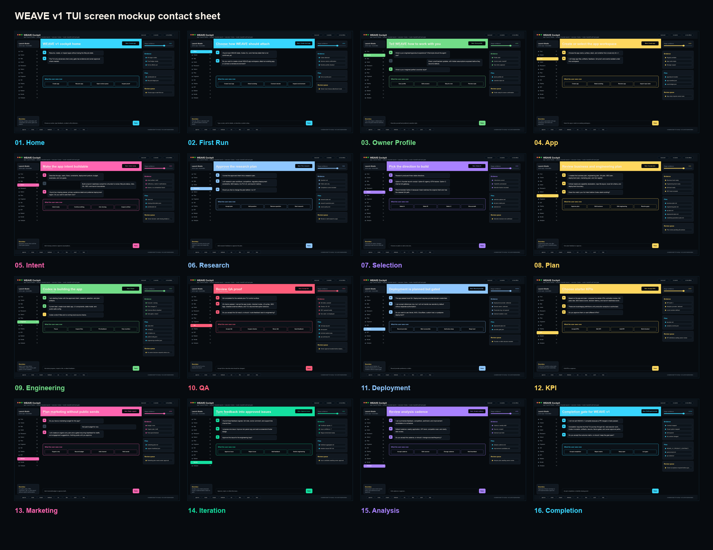

## 01. Home
- Stage status: ready
- User-visible decision: Create app, Resume app, Open review queue, Inspect proof
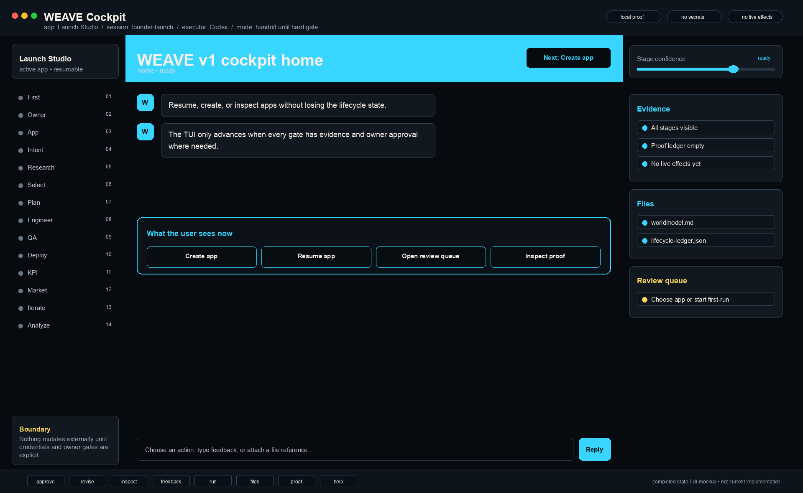

## 02. First Run
- Stage status: needs choice
- User-visible decision: Create local app, Attach existing, Connect remote, Inspect environment
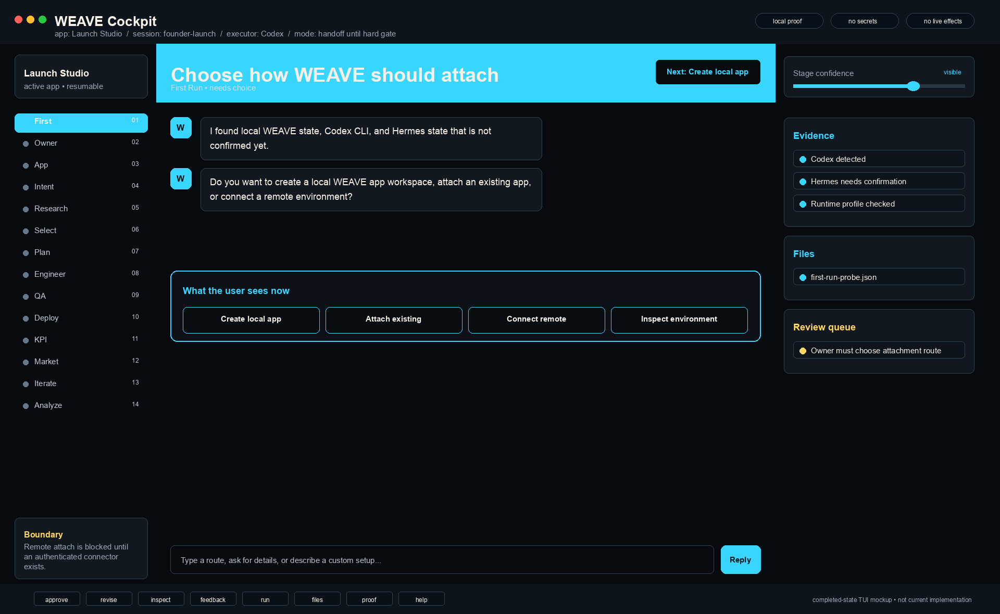

## 03. Owner Profile
- Stage status: collecting
- User-visible decision: Save profile, Edit answers, Skip for now, Preview style
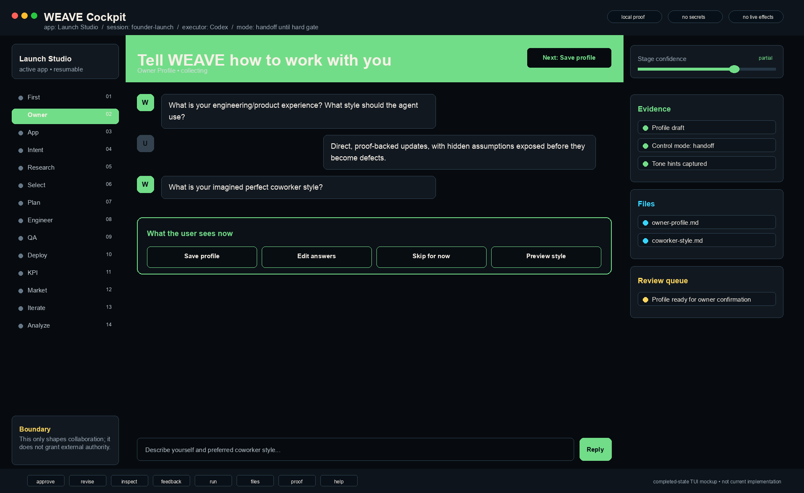

## 04. App
- Stage status: selecting
- User-visible decision: Create app, Select existing, Rename app, Import repo state
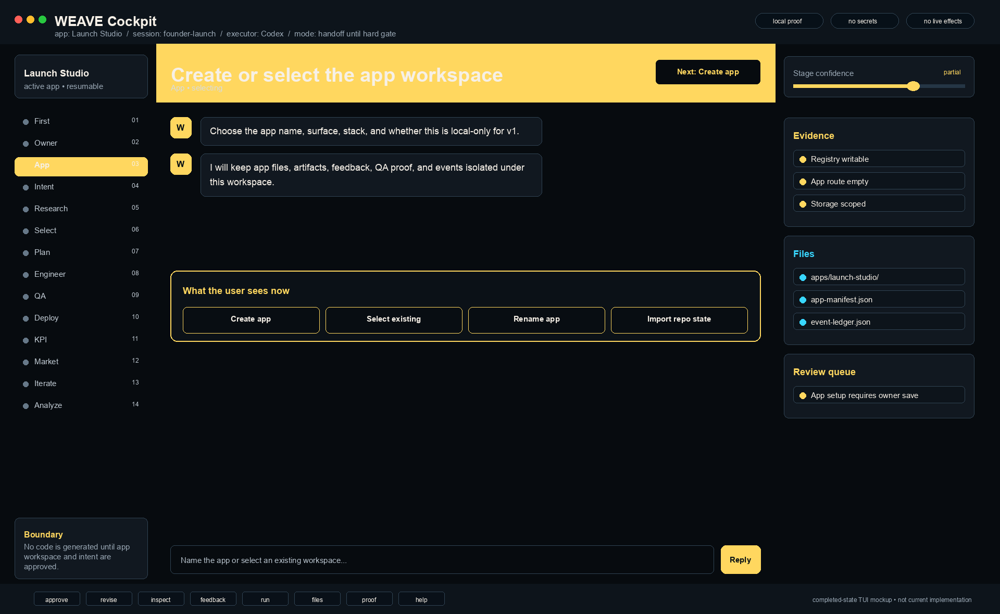

## 05. Intent
- Stage status: validating
- User-visible decision: Intent ready, Continue editing, Ask missing, Inspect artifact
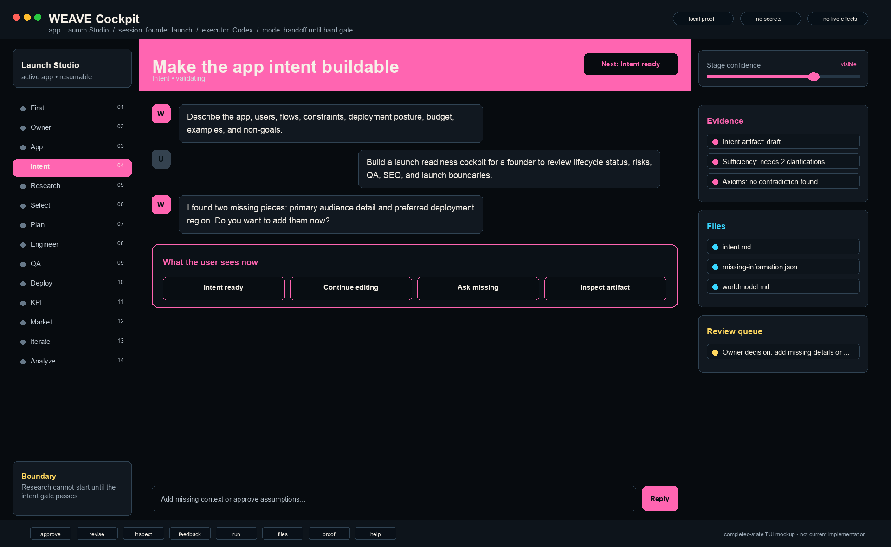

## 06. Research
- Stage status: plan review
- User-visible decision: Accept plan, Add question, Remove question, Start research
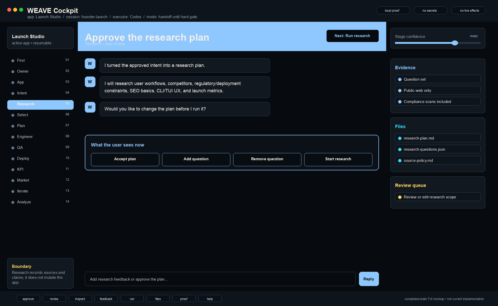

## 07. Selection
- Stage status: choosing
- User-visible decision: Select A, Select B, Select C, Discuss/edit
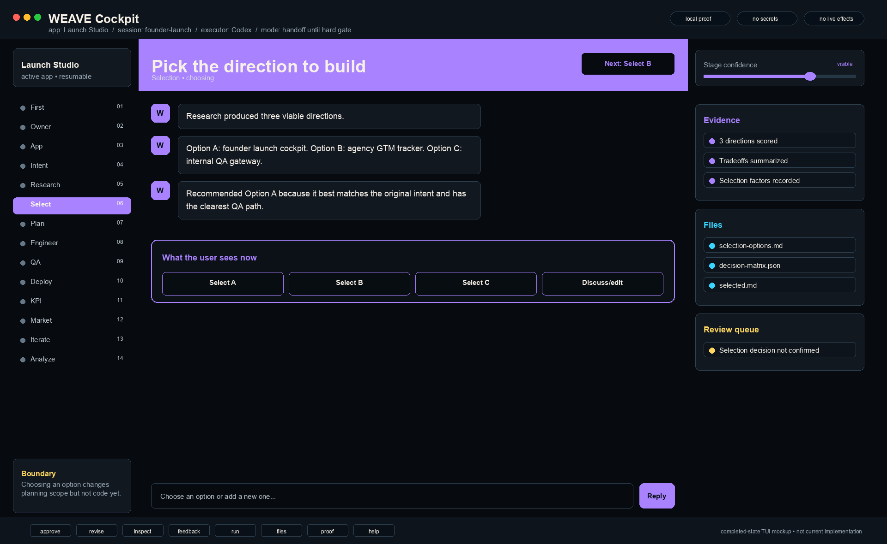

## 08. Plan
- Stage status: reviewing
- User-visible decision: Approve plan, Edit business, Edit engineering, Resolve gaps
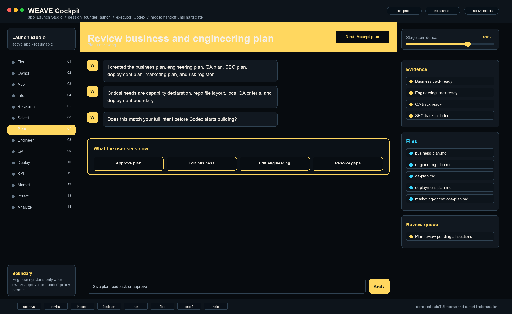

## 09. Engineering
- Stage status: running
- User-visible decision: Pause, Inspect files, File feedback, View manifest
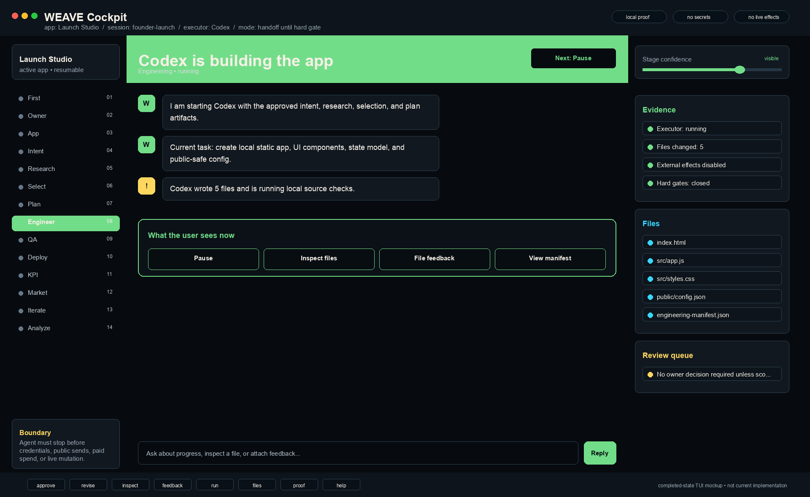

## 10. QA
- Stage status: ready for review
- User-visible decision: Accept QA, Inspect checks, Rerun QA, Send feedback
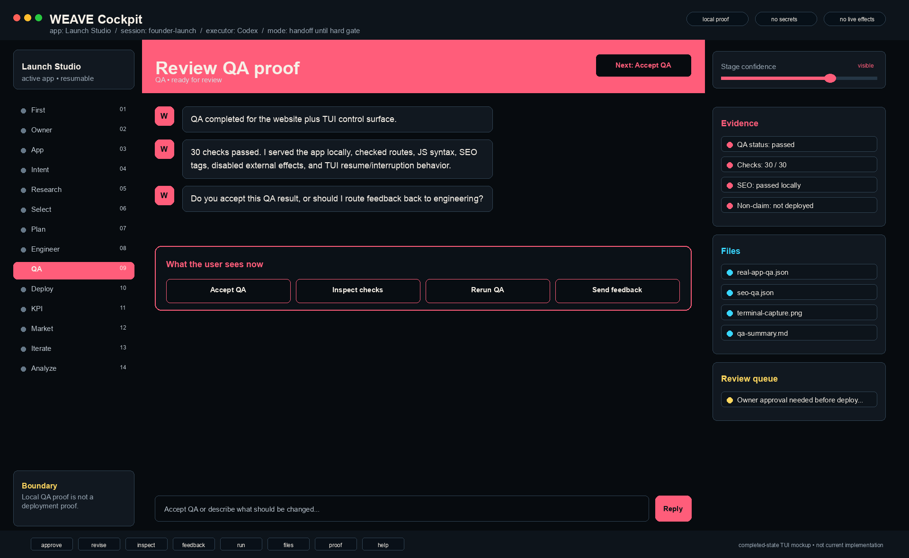

## 11. Deployment
- Stage status: blocked
- User-visible decision: Record provider, Mark accessible, Authorize setup, Keep local
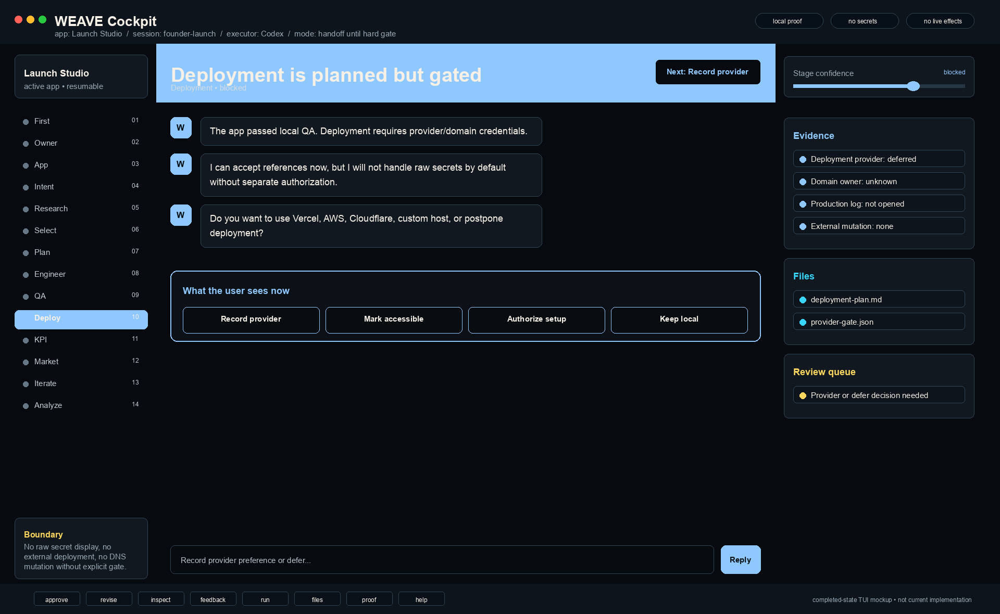

## 12. KPI
- Stage status: draft
- User-visible decision: Accept KPIs, Edit KPI, Add KPI, Mark blocked
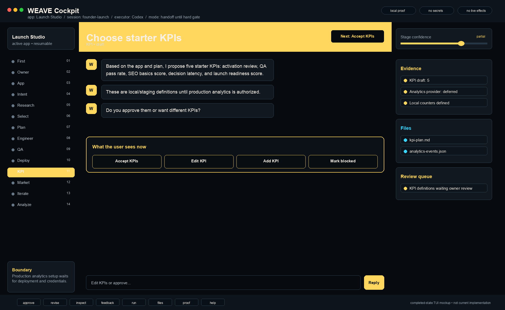

## 13. Marketing
- Stage status: gated plan
- User-visible decision: Organic only, Record budget, Add channel, Hold sends
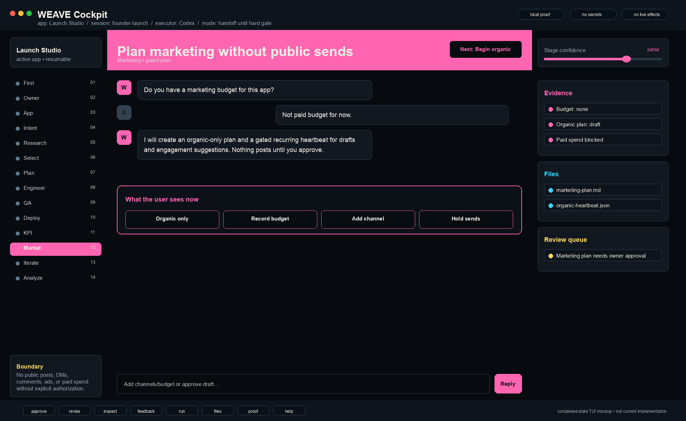

## 14. Iteration
- Stage status: monitoring
- User-visible decision: Approve issue, Reject issue, Add feedback, Switch engineering
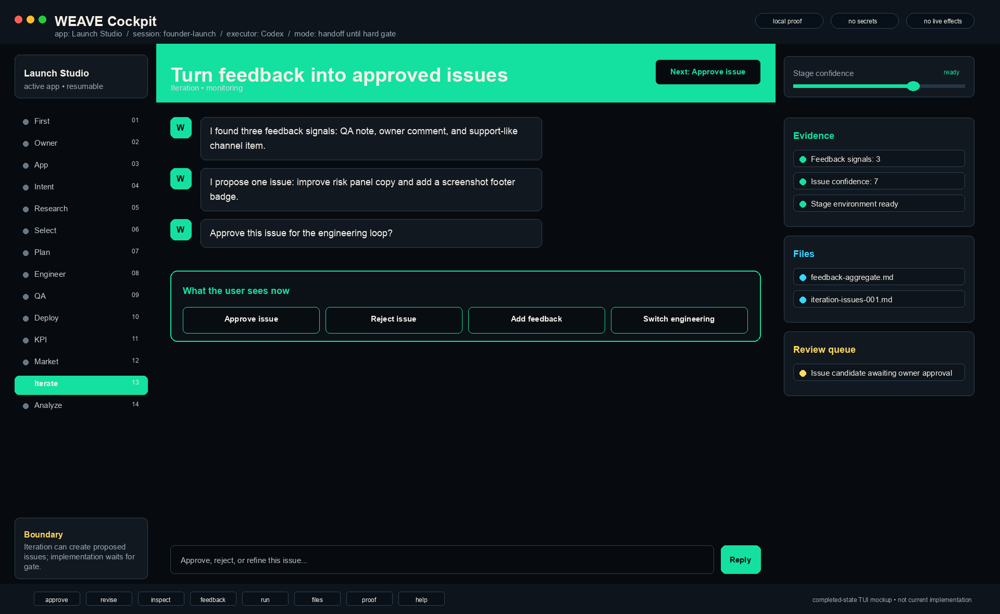

## 15. Analysis
- Stage status: planned
- User-visible decision: Accept cadence, Edit sources, Change cadence, Hold heartbeat
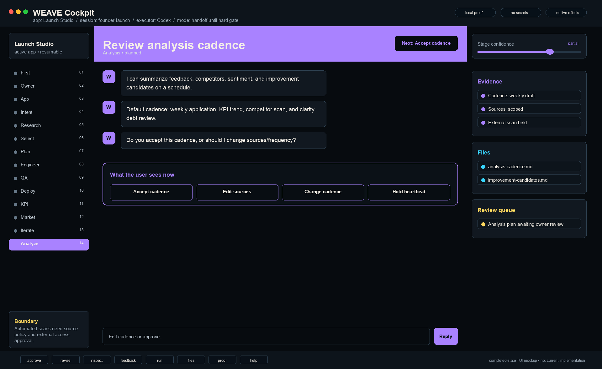

## 16. Completion
- Stage status: not done until proven
- User-visible decision: Accept completion, Reject matrix, Keep open, List gaps
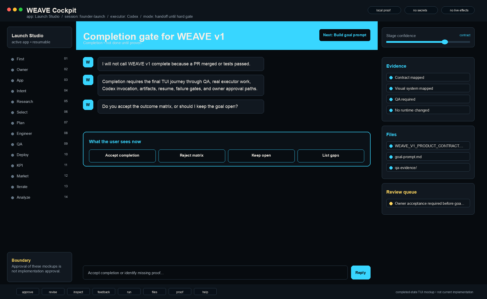
