# WEAVE V1 Completed User Journey Slides

Status: review deck generated from `docs/WEAVE_V1_PRODUCT_CONTRACT.md`.

These slides show the intended completed product journey, not the current implementation.

---

## WEAVE V1 Completed Journey

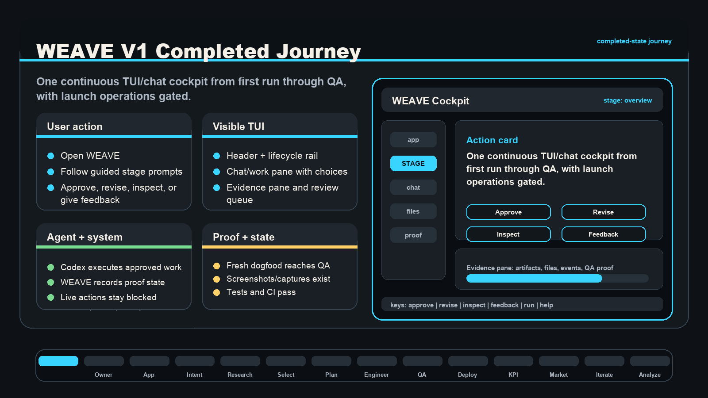

---

## 1. First Run And Environment Detection

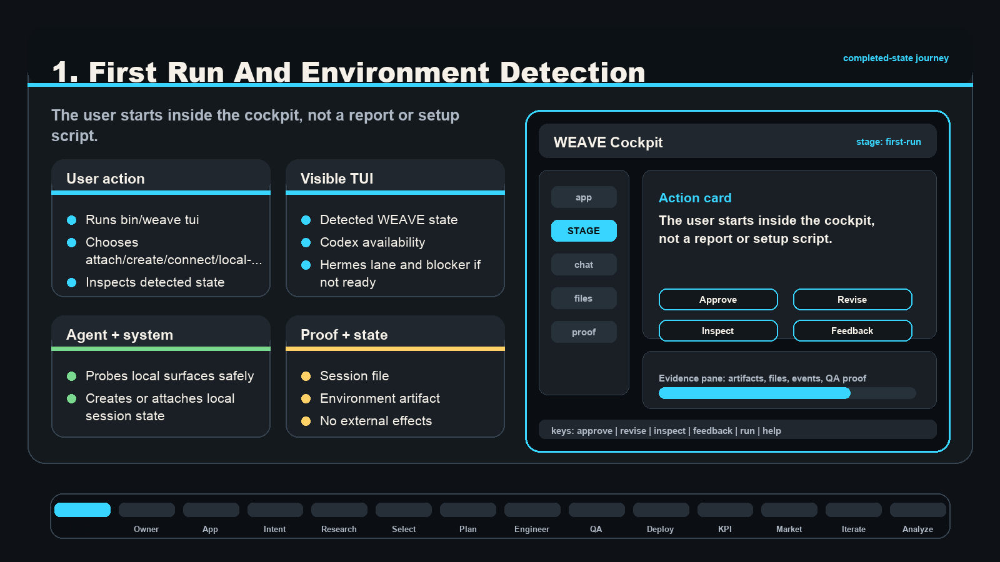

---

## 2. Owner Profile

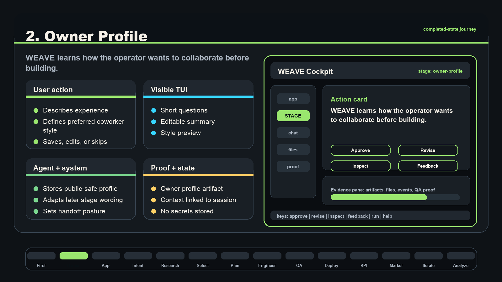

---

## 3. Create Or Select App

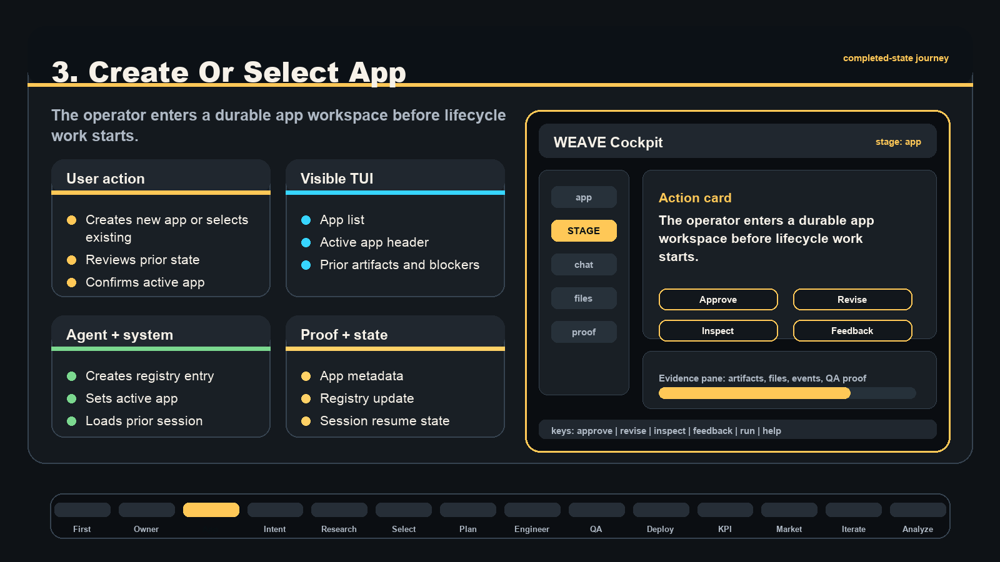

---

## 4. Intent

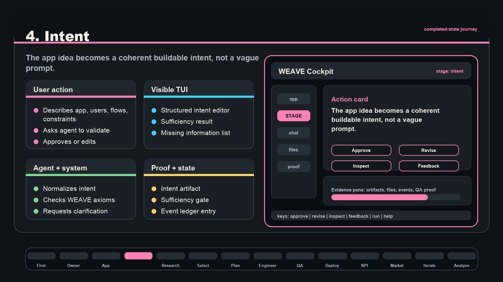

---

## 5. Research

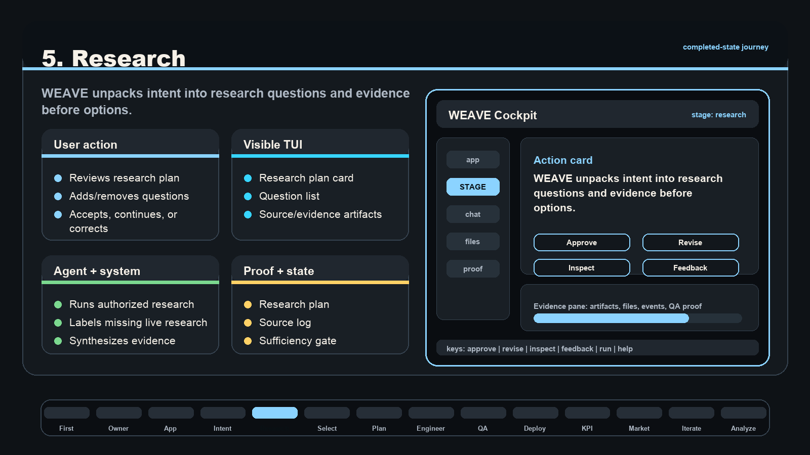

---

## 6. Selection

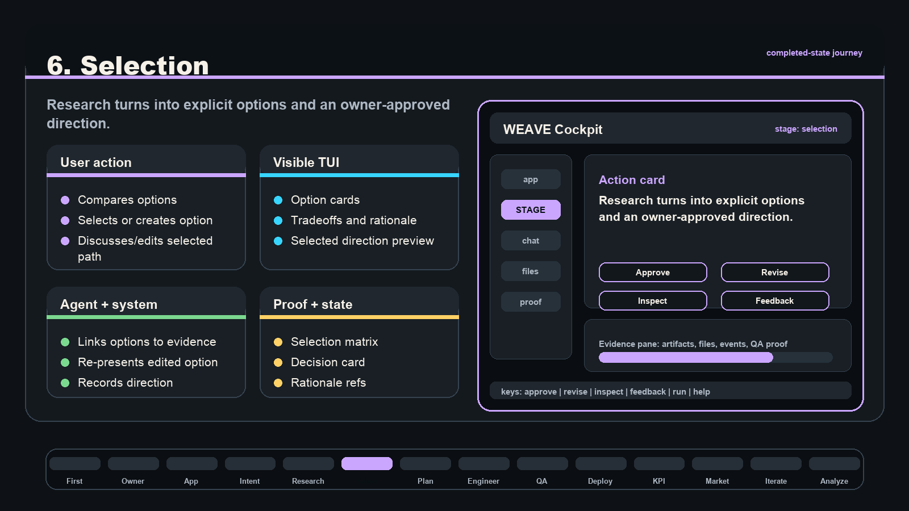

---

## 7. Plan

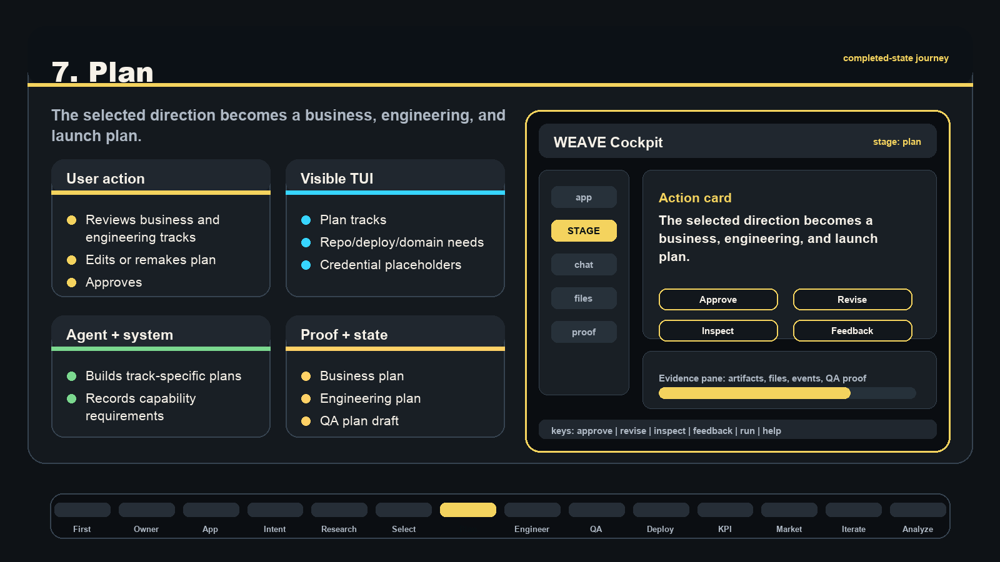

---

## 8. Engineering With Codex

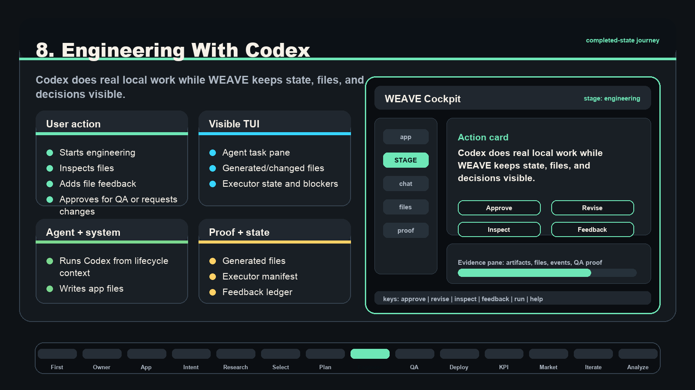

---

## 9. QA

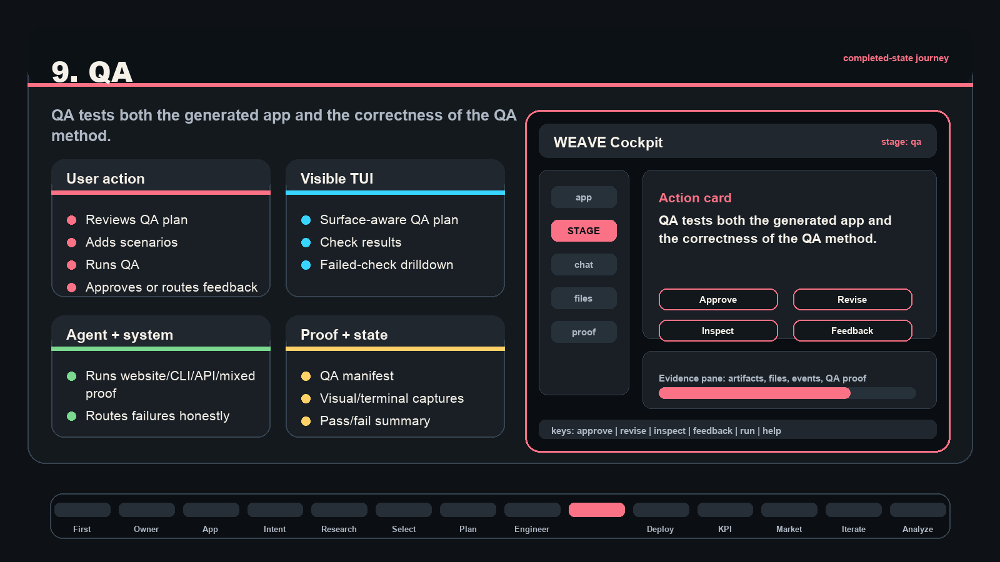

---

## 10. Deployment Gate

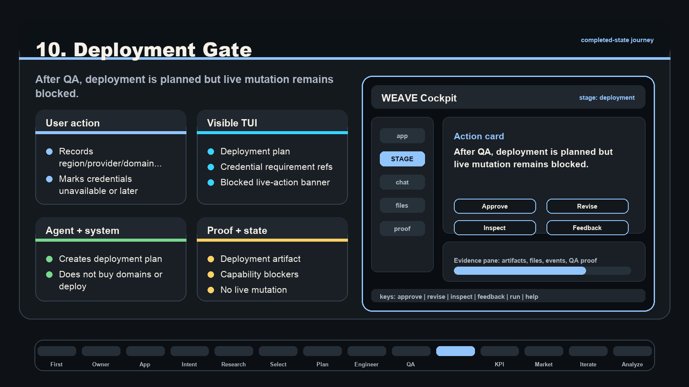

---

## 11. KPI Setup

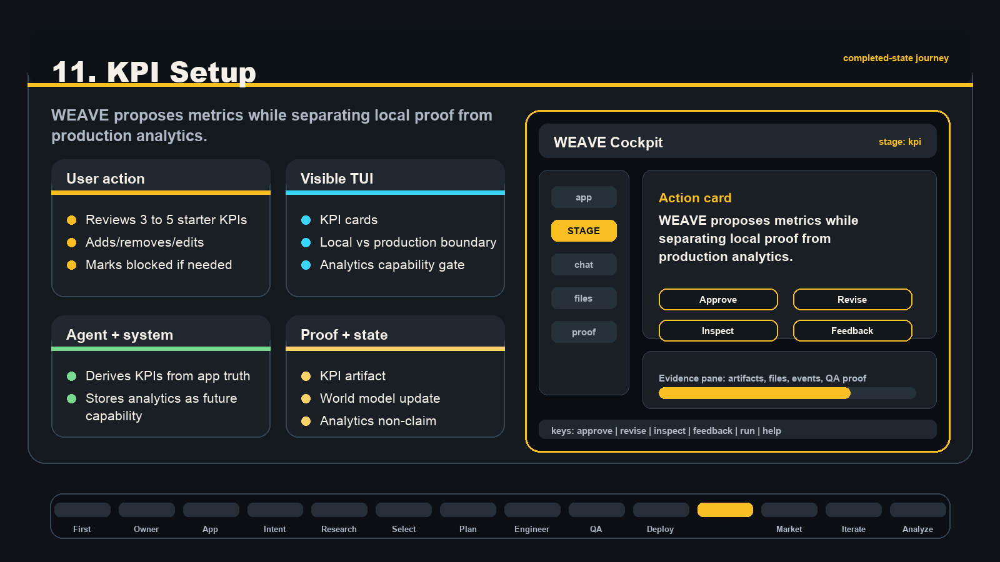

---

## 12. Marketing

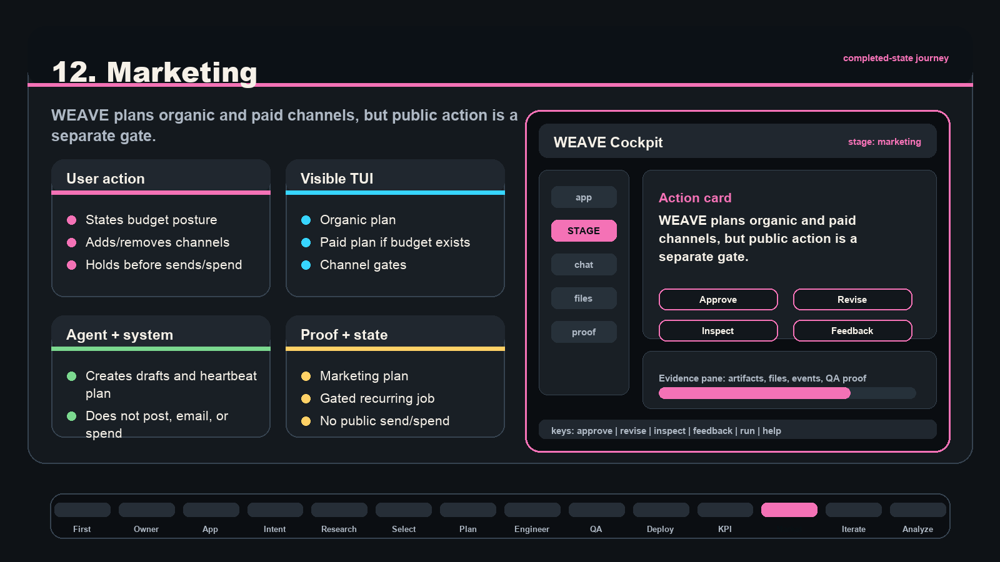

---

## 13. Iteration

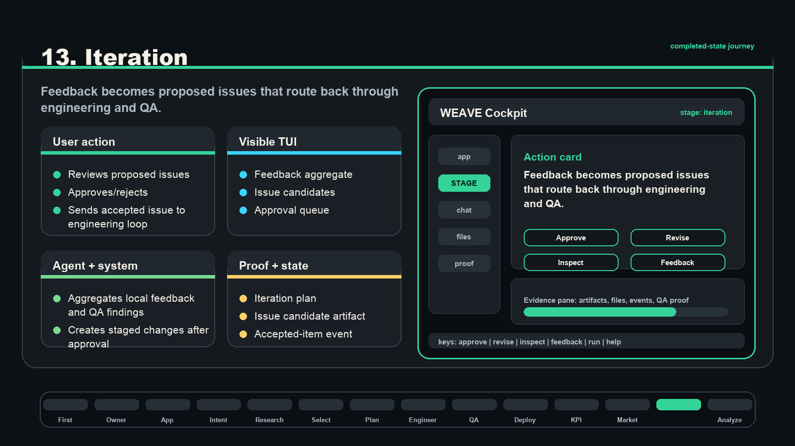

---

## 14. Analysis

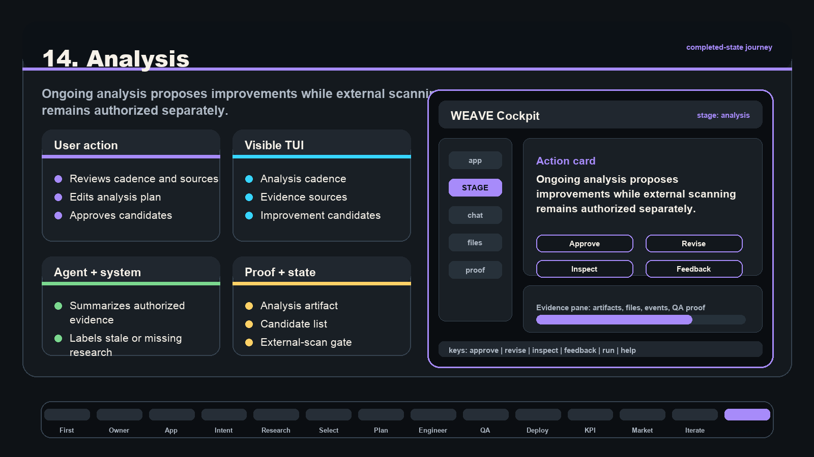

---

## Completion Gate

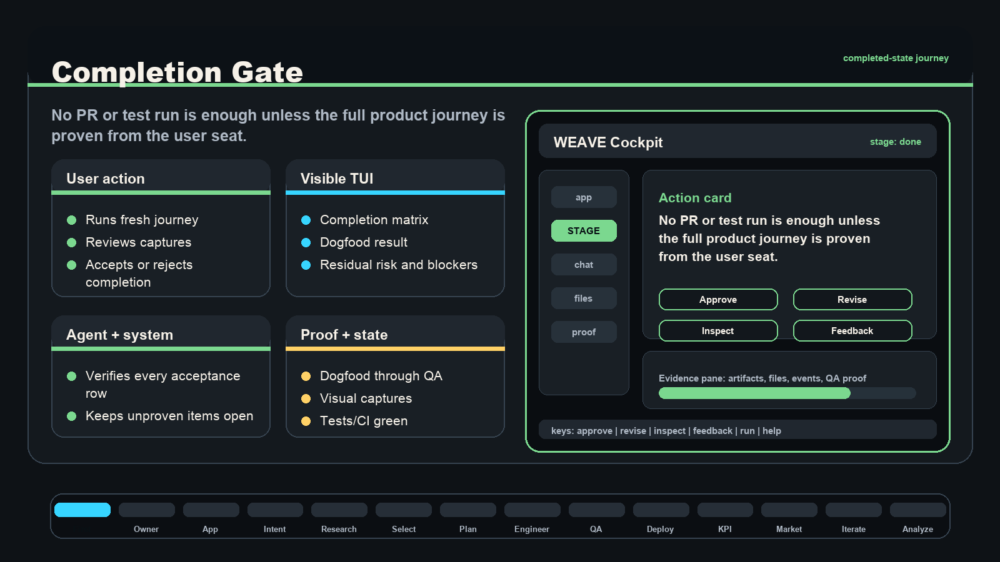
